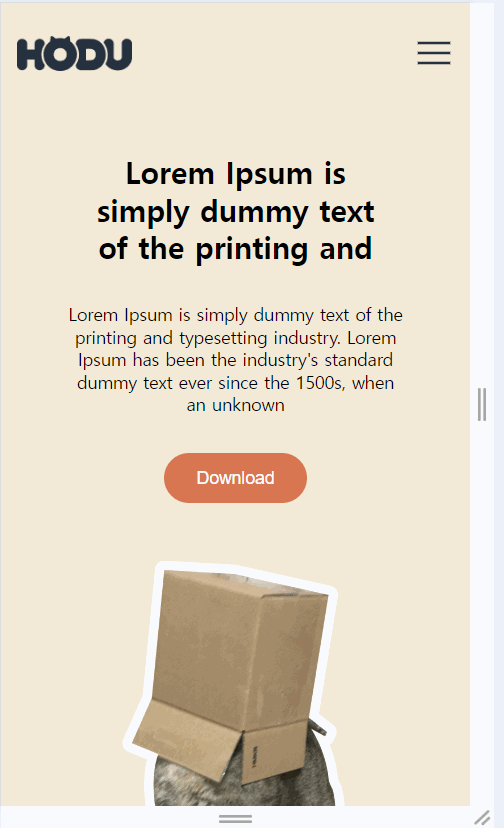

# FE 프로젝트
## 프로젝트 개요
HTML, CSS, JavaScript 이용하여 레이아웃과 기능 구현하기
     

## 배포 url
Github주소 :https://github.com/yslee05/FEproject/tree/master
     

## 요구사항 명세
1. 피그마를 참고하여 페이지 구현을 합니다.
2. 스크롤시 헤더가 고정되게 합니다. (단, 처음에는 고정된 상태가 아닙니다.)
3. 스크롤 탑 버튼을 구현합니다. 
    1. 스크롤 탑 버튼은 스크롤시 나타납니다.
    2. 스크롤 탑 버튼은 푸터 아래로 내려가지 않습니다.
    3. 스크롤 탑 버튼을 누르면 스크롤이 최상단으로 올라갑니다. (단, 부드럽게 올라가야 합니다.)
4. 구독하기 모달창
    1. 이메일을 입력하고 `Subscribe` 버튼을 클릭하면 모달창이 나타납니다.
    2. 이메일 유효성 검사를 진행해야 합니다. (값이 들어가지 않거나 이메일 형식이 유효하지 않으면 alert 창으로 경고 문구가 떠야합니다.)
    3. 이메일이 잘 입력되었다면 모달창이 뜹니다. 이때 모달창의 `OK! I love HODU` 버튼을 클릭하면 form이 제출되고 모달창이 닫힙니다.
5. (추가 과제)모바일 화면도 고려하여 반응형으로 제작합니다
   

## 기능 세부 설명
1. 스크롤 시 상단바 (헤더) 상단 고정 
 
2. 스크롤 탑 버튼
   - 스크롤시 스크롤탑 버튼 나타남     
   - 스크롤탑 버튼은 푸터 아래로 내려가지 않음      
   - 버튼은 누르면 스크롤이 최상단으로 부드럽게 올라감
   - hover시 마우스와 버튼색 변경
  
3. 구독하기 모달창 구현
   - 이메일 입력 후 Subscribe 버튼 클릭시 이메일 유효성 검사,모달창 나타남  
   - <OK! I love HODU> 버튼 클릭시 폼 제출, 모달창 닫힘
   - 이메일 아이콘 label

4. 모바일에서 레이아웃 변경    
   섹션별로 @media (max-width: 375px) 이용하여 레이아웃 설정   
   *안드로이드는 360 X 740px  iOS는 375 X 812px, 더 큰 ios를 경계로 설정

5. 모바일 메뉴 창 열기 닫기
   - 메뉴 아이콘 클릭시 메뉴창 생김
   - 화살표 클릭시 메뉴창 없어짐

     

## 파일 구조
├── index.html               # 메인 HTML 파일 + JavaScript  
├── project.css              # 스타일링을 위한 메인 CSS 파일  
├── Group.png            # 로고 이미지  
├── menu.svg             # 모바일 보기용 메뉴 아이콘  
├── img_cat_png.png      # 헤더에 사용된 고양이 이미지  
├── ...                  # 기타 이미지들  
├── readMe                    # 프로젝트 설명 파일  
└── 실행화면            #  readme에 들어갈 스크린샷
    

## 실행화면
|                | 실행화면                                           |
|----------------|---------------------------------------------------|
| **웹 화면**    |                 |  
| **모바일 화면**|             |

     
         

## 프로젝트 회고
- 초반에 큰 틀을 보지 못하고 생각나는 대로 코드를 작성하다 보니, 전체적인 코드가 체계적이지 못했던 것 같다.   
html에서 태그를 생각나는 대로 사용하여 h태그와 anchor태그, 버튼이 불규칙하게 들어갔고, 불필요하게 여러 단계로 태그를 묶거나 속성을 중복 적용하는 경우가 있었다.   
중간에 이 문제를 느꼈는데 다시 한다면 더 효율적으로 만들 수 있을 것 같다.  
- 속성이 적용되지 않을 때 important를 몇 번 사용했다. 선택자 우선순위 문제인것을 나중에 깨달았다.  
- 반응형 레이아웃을 구현할 때, 정해진 컴퓨터와 모바일 크기에서 각각 디자인하였는데 반응형 디자인에 대한 개념이 부족했던 것 같다.
- 멘토님께 질문을 많이 했는데 늘 잘 알려주신 덕분에 잘 마무리 할 수 있었다.
         
         
            
                  
                  
         

