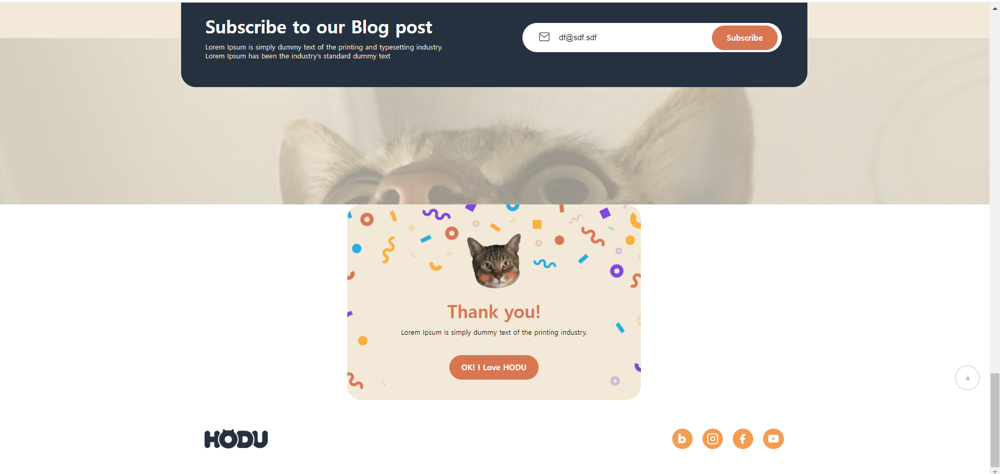
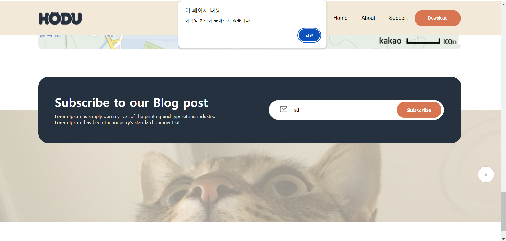
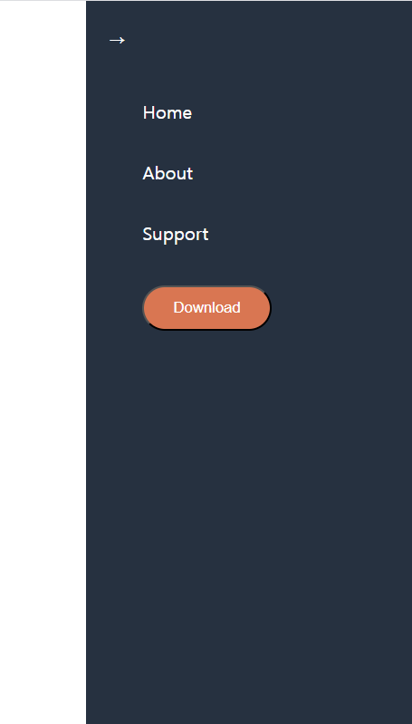

# FE 프로젝트
## 프로젝트 개요
HTML, CSS, JavaScript 이용하여 레이아웃과 기능 구현하기
     

## 파일 구조
├── index.html               # 메인 HTML 파일 + JavaScript  
├── project.css              # 스타일링을 위한 메인 CSS 파일  
├── Group.png            # 로고 이미지  
├── menu.svg             # 모바일 보기용 메뉴 아이콘  
├── img_cat_png.png      # 헤더에 사용된 고양이 이미지  
├── ...                  # 기타 이미지들  
├── readMe                    # 프로젝트 설명 파일  
└── 실행화면            #  readme에 들어갈 스크린샷  
    

## 기능
1. 스크롤 시 상단바(헤더) 상단 고정
2. 스크롤 탑 버튼 구현
3. 구독하기 모달창 구현
4. 모바일에서 레이아웃 변경
5. 모바일 메뉴 창 열기, 닫기
   
     
## 기능 세부 설명
1. 스크롤 시 상단바 (헤더) 상단 고정
     : 스크롤하여 상단바가 보이지 않을 때 헤더 고정   
 
2. 스크롤 탑 버튼
   - 스크롤시 스크롤탑 버튼 나타남  
     : 최상단에서 스크롤 탑 버튼이 안 보임    
     
   -스크롤탑 버튼은 푸터 아래로 내려가지 않음  
     : 버튼 위치를 푸터보다 높게 지정
     
   - 버튼은 누르면 스크롤이 최상단으로 부드럽게 올라감
   - hover시 마우스와 버튼색 변경
  
3. 구독하기 모달창 구현
   - 이메일 입력 후 Subscribe 버튼 클릭시 이메일 유효성 검사,모달창 나타남  
   - <OK! I love HODU> 버튼 클릭시 폼 제출, 모달창 닫힘  

4. 모바일에서 레이아웃 변경
   섹션별로 @media (max-width: 375px) 이용하여 레이아웃 설정 
   *안드로이드는 360 X 740px  iOS는 375 X 812px, 더 큰 ios를 경계로 설정

5. 모바일 메뉴 창 열기 닫기
   - 메뉴 아이콘 클릭시 메뉴창 생김
   - 화살표 클릭시 메뉴창 없어짐

     

## 실행화면
|            | 웹                                                                                 | 모바일                      |
|------------|------------------------------------------------------------------------------------|---------------------------------------------|
| **전체화면** |                                         |   
| **기능**   | **웹 모달**                       | **모바일 모달**                 |
|            | **웹 이메일 실패시 alert**       |**모바일 메뉴창**     
     
    
## 프로젝트 회고
초반에 큰 틀을 보지 못하고 생각나는 대로 코드를 작성하다 보니, 전체적인 코드가 체계적이지 못했던 것 같다.   
불필요하게 여러 단계의 태그를 묶거나 속성을 중복 적용하는 경우가 있었다. 중간에 이 문제를 느꼈는데 다시 한다면 더 효율적으로 만들 수 있을 것 같다.  
속성이 적용되지 않을 때 important를 몇번 사용했다. 선택자 우선순위 문제인것을 나중에 깨달았다.  

